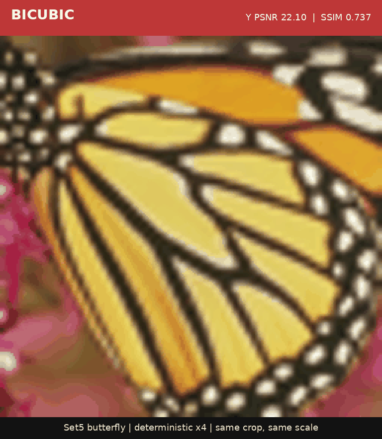

# LuSIR

[](paper/sr_diffusion_report.pdf)
[](https://colab.research.google.com/github/BitIntx/LuSIR/blob/main/notebooks/sr_diffusion_colab_demo.ipynb)
[](LICENSE)
[](CHECKPOINT_LICENSE.md)

**LuSIR**: **Latent Upscaling via Self-trained Image Restoration**.

## Current Demo

<p align="center">
  
</p>

Noisy LR input to LuSIR deterministic x4 output. Gaussian noise `sigma=4/255`.

LuSIR is a vision-only x4 latent diffusion super-resolution research project.
The canonical report source is
[paper/TECHNICAL_REPORT.md](paper/TECHNICAL_REPORT.md);
[paper/sr_diffusion_report.pdf](paper/sr_diffusion_report.pdf) and
[paper/main.tex](paper/main.tex) are generated from it with
`paper/build_report.sh`.
The current residual-refiner visual review procedure and honest qualitative
positioning are documented in [docs/VISUAL_REVIEW_KO.md](docs/VISUAL_REVIEW_KO.md).

This is a public source-available, non-commercial research project. The goal is
to train an SR model directly, without using a pretrained text-to-image
diffusion model. The intended final model handles photo and anime/illustration
domains in one codebase with domain conditioning.

Compatibility note: W&B history, local scratch paths, older experiment configs,
and the Python import namespace still use `sr-diffusion` or `sr_diffusion` so
existing runs, checkpoints, and scripts keep working.

This repository is not OSI-approved open source because commercial use is not
permitted.

## Goal

Target task:

```text
LR 128x128 -> HR 512x512
LR 192x192 -> HR 768x768 later
```

Planned model:

```text
HR image
  -> factor-4 VAE / autoencoder
  -> HR latent

LR image
  -> condition encoder
  -> multi-scale LR features

noisy HR latent + LR features + timestep + domain embedding
  -> conditional diffusion U-Net
  -> denoised HR latent
  -> VAE decoder
  -> x4 SR output
```

Constraints:

- PyTorch first.
- ROCm/GPU primary.
- No custom CUDA/ROCm ops.
- TPU/XLA compatibility is a later consideration, so code should stay close to
  standard PyTorch where practical.
- No pretrained T2I model dependency.

## Current Status

The stage numbers describe the **training sequence**, not a runtime chain that
always executes Stage 1 -> 2 -> 3 -> 4. Current inference paths are:

```text
Colab default / public deterministic:
  LR -> guarded-detail Stage 2 step 10000 -> Stage 1 VAE decoder -> SR

Conservative deterministic option:
  LR -> Stage 2 XL step 72000 -> residual refiner v2 step 39000
     -> Stage 1 VAE decoder -> SR

Research deterministic candidate:
  LR -> multiscale Stage 2 step 46000 -> Stage 1 VAE decoder -> SR

Current detail research candidate:
  LR -> dual-context LSDIR Stage 2 step 98000 -> Stage 1 VAE decoder
     -> learned detail mask step 3250
     -> masked high-frequency detail branch v2 step 38000 -> SR

Generative comparison:
  LR -> Stage 2 condition encoder -> Stage 3 OR Stage 4 diffusion U-Net
     -> Stage 1 VAE decoder -> SR
```

Stage 4 is a Stage 3-derived replacement checkpoint, not a module applied after
Stage 3. The planned Stage 5 distillation would replace the slower Stage 3/4
sampler with a faster one; it would not be appended after Stage 4.

The Colab notebook now defaults to the deterministic guarded-detail Stage 2
step 10000 path with tile batch size 1, because it is the best current
T4-friendly checkpoint and does not need the slower diffusion sampler. Users can
explicitly select residual refiner v2, masked detail branch v2, detail branch
v1d, or Stage 3/4 diffusion comparisons in the notebook. The latest
VGG-feature-supervised continuation of multiscale Stage 2 step 46000 is
complete but not promoted.
The later dual-context LSDIR Stage 2 run is also complete: step 98000 is the
cleaner-preset best checkpoint, while step 100000 is slightly safer on strong
degradations.
The high-frequency detail branch v1d run is complete. It expands the branch
from 1.35M to 3.02M parameters, starts from v1c with identity-initialized added
blocks, and selects step 99500 after exactly three epochs. It is the latest
preserved public detail artifact, while the public Colab default is now the
guarded-detail Stage 2 step 10000 path.

The teacher-filtered v7 detail probe,
`configs/detail_branch_v7_teacher_filtered_hinge_probe.yaml`, is implemented
and stopped at step 500. It keeps the frozen dual-context Stage 2 + Stage 1
base, starts from masked detail v2, and uses RealESRGAN only where its local
highpass error is near/better than the base against GT. The learned detail mask
was relaxed from hard top10 to top20 with a small floor so teacher-positive
patches were not blocked before the branch could learn. The path is not
promoted: step500 still had positive PSNR/SSIM deltas, but highpass and
laplacian ratios regressed and the eval grid showed no visible detail
breakthrough. Notes are in
[`docs/DETAIL_BRANCH_V7_TEACHER_FILTERED_KO.md`](docs/DETAIL_BRANCH_V7_TEACHER_FILTERED_KO.md).
The follow-up teacher patch diagnostic found that RealESRGAN did not beat the
base on PSNR or highpass-L1 for any of the first 256 cached training samples.
The v8 GT-mask training probe therefore removed teacher supervision and used a
GT detail-need mask only during training. It was stable and selected step 500,
but visible detail gains stayed small and step 2000 began to lose laplacian
ratio, so it is preserved as a diagnostic result rather than promoted. Eval and
inference still used the learned noise-negative mask. See
[`docs/TEACHER_PATCH_QUALITY_KO.md`](docs/TEACHER_PATCH_QUALITY_KO.md) and
[`docs/DETAIL_BRANCH_V8_GTMASK_KO.md`](docs/DETAIL_BRANCH_V8_GTMASK_KO.md).
The follow-up Stage2 GT-masked detail probe,
`configs/latent_pretrain_photo130k_lsdir_dual_detail_gtmasked_v3_probe.yaml`,
starts from guarded-detail Stage2 v2 step 10000 and adds a train-only
missing-detail weighted decoded/highpass loss. It was stopped at step1000:
mean PSNR rose slightly, but highpass ratio and missing-detail metrics worsened,
so it is not continued. See
[`docs/STAGE2_GTMASKED_DETAIL_V3_KO.md`](docs/STAGE2_GTMASKED_DETAIL_V3_KO.md).

The latest guarded-detail Stage 2 candidate
`latent_pretrain_photo130k_lsdir_dual_detail_guarded_v2` was continued for
20,000 micro-steps from the dual-context LSDIR step 98000 checkpoint. It stayed
stable but plateaued; the final step 20000 was not the best detail checkpoint.
The selected candidate is `best_eval_mean_psnr_detail.pt`, which corresponds to
step 10000. On the val100 guardrail it reached `24.6296` decoded PSNR,
`26.5050` mean PSNR, `0.8084` highpass energy ratio, `0.01897` missing energy,
and the best composite detail score in that run. This checkpoint is the current
T4-friendly Colab default, while residual refiner v2 remains available as a
more conservative deterministic option.

The formal full-image x4 benchmark is now implemented and complete for DIV2K
validation, Set5, Set14, and Urban100. Detail v1d improves its frozen
dual-context base on every dataset under MATLAB-compatible Y-channel PSNR/SSIM
with a four-pixel border shave. Its Y PSNR is `30.1602`, `31.8892`, `28.4123`,
and `25.8755 dB`, respectively. The largest branch gain is `+0.3939 dB` on
Urban100. See [`docs/SR_BENCHMARK.md`](docs/SR_BENCHMARK.md) for the protocol,
external baseline results, and interpretation.

Masked detail v2 also completes the same 219-image protocol and improves v1d
on all four datasets, but only modestly: Y PSNR changes by `+0.0034`,
`+0.0602`, `+0.0135`, and `+0.0167 dB` on DIV2K, Set5, Set14, and Urban100.
The overall gain is `+0.0114 dB` Y PSNR and `+0.00118` Y SSIM. This confirms a
reproducible correction gain, not a visible fine-texture breakthrough.

The public guarded-detail Stage 2 v2 step10000 Colab default was also swept
with TTA on the same 219-image protocol using a fast PSNR-only evaluation. Off,
horizontal flip x2, and full x8 self-ensemble reach `27.8539`, `27.9067`, and
`27.9496 dB` mean Y PSNR, respectively. Full x8 therefore adds `+0.0957 dB`
over off, but visible differences are small and runtime is roughly 8x. It
remains an optional review mode, not the default.

The official SwinIR classical x4 baseline reaches `31.0838 dB` Y PSNR and
`0.85228` Y SSIM on the same DIV2K validation evaluator, ahead of detail v1d
by `0.9235 dB` and `0.01807`. This makes the next clean-fidelity priority
clear: improve the Stage 2/base reconstruction path before increasing detail
branch capacity again.

The clean-bicubic Stage2 continuation is isolated in
`configs/latent_pretrain_photo130k_lsdir_dual_bicubic_fidelity_continue.yaml`.
It continues from dual-context best98000 on `benchmark_bicubic` with a
PSNR-oriented decoded loss balance and uses the new `stage2_base` benchmark
runner variant for formal full-image evaluation. Its task-specific val100 proxy
improved gradually from `25.019` at step 1000 to a best `25.057` at step 15000,
then remained effectively flat (`25.054` at step 17000). These values are not
the formal full-image Y-channel benchmark above.

Learning-rate probes confirmed that optimization speed is not the main
bottleneck. A `20x` LR continuation collapsed to `15.72 dB` at its first eval.
A `5x` LR from-init run reached `25.033` at step 4000 versus `25.031` for the
original LR, an evaluation-noise-level difference. The original `5e-6` LR is
therefore retained, but another long same-objective continuation is not
expected to close the full SwinIR gap or create visibly new texture.

A clean-bicubic Stage2 overfit diagnostic is now isolated in
`configs/latent_pretrain_photo130k_lsdir_dual_bicubic_overfit64_probe.yaml`.
It fixes the first 64 train samples with deterministic crop/degradation and
evaluates on the same 64 images. This is not a deployable candidate; it tests
whether the current Stage2 structure/loss can memorize high-frequency detail at
all when generalization is removed. It completed 3000 micro-steps and improved
train64 from `26.4246` to `29.2477` mean PSNR, `0.7908` to `0.8812` highpass
ratio, and `0.01971` to `0.01314` missing energy. This weakens the
"architecture cannot represent detail" hypothesis and points the next work
toward data/curriculum/regularization for generalizing that detail signal. See
[`docs/STAGE2_BICUBIC_OVERFIT64_KO.md`](docs/STAGE2_BICUBIC_OVERFIT64_KO.md).

The later Stage 2 detail-perceptual continuation from dual-context best98000
also completed formal 219-image evaluation. Its latest step12000 checkpoint is
nearly tied with dual best98000 (`27.8356` vs `27.8431` Y PSNR) and slightly
higher on SSIM (`0.79827` vs `0.79742`), but the visible crop review still shows
only subtle differences. It is preserved as a research candidate, not promoted
as the default Stage 2 checkpoint.

The Stage 2 shifted-window attention probes are also complete and not
promoted. The v2 probe accidentally disabled the second dual-context branch,
so it is not used as evidence against attention itself. The corrected
true-dual v3 probe with `8x8` windows and the follow-up `12x12` window probe
both stayed near the dual-context baseline: decoded PSNR remained
`24.60-24.63` on the val100 proxy while detail ratio oscillated without a
visible texture breakthrough. Larger windows increased cost without solving
the conditional-mean smoothing problem. The next Stage 2 direction is therefore
not wider attention windows, but a residual/detail correction path on top of a
frozen or preserved fidelity base.

A Stage 1 decoder capacity audit was added after the v5 PatchGAN collapse.
On `photo_detail_mix` val100, HR autoencoding through Stage 1 reaches mean
PSNR `41.8121`, highpass ratio `0.9965`, and laplacian ratio `0.9553`, while
the same decoder fed by Stage 2 dual-context best98000 reaches mean PSNR
`26.4889`, highpass ratio `0.7886`, and laplacian ratio `0.3191`. This points
to Stage 2 conditional-mean smoothing as the active bottleneck, not Stage 1
decoder capacity. Stage 2 eval now logs mean per-image PSNR, SSIM, highpass
ratio, and missing/excess detail energy; the guarded follow-up config is
`configs/latent_pretrain_photo130k_lsdir_dual_detail_guarded_v2.yaml`.

For the next texture-generator gate, the learned detail mask was stress-tested
with injected synthetic noise. The original v1 predictor opened the top-10%
gate on noise patches (`0.4531` coverage), which is useful evidence for
denoise/correction but unsafe for texture synthesis. A v2 noise-negative
predictor starts from v1 and adds noisy/excess negative augmentation; its best
step 1500 preserves clean top-10 selection score (`0.7219` vs `0.7173`) while
reducing injected-noise top-10 coverage to `0.0000`. See
[`docs/DETAIL_NEED_MASK_KO.md`](docs/DETAIL_NEED_MASK_KO.md). The preserved
artifact set is available with
`python scripts/download_hf_checkpoints.py --preset detail_mask_predictor_v2_noise_negative`.
The completed v5 detail-generator probe,
`configs/detail_branch_v5_noise_gate_top10_patch_gan_probe.yaml`, used that v2
gate as a hard top-10% binary mask with zero floor before applying masked
perceptual and PatchGAN pressure. It was stopped at step 3500 after the
PatchGAN phase collapsed
fidelity (`+0.0537 dB` at step 500 to `-0.0953 dB` at step 3500). The v2 gate
remained closed outside the selected top-10% region, so the failure is recorded
as adversarial high-frequency artifact growth inside the mask rather than a
mask-leak problem.
The follow-up v6 probe keeps the same v2 top-10% gate but removes GAN pressure.
It combines masked perceptual loss, locally filtered RealESRGAN highpass
teacher signal, and a new negative residual loss that suppresses residual
energy in flat or already-over-sharp regions. The config is
`configs/detail_branch_v6_noise_gate_teacher_perceptual_no_gan_probe.yaml`; the
design and stop criteria are documented in
[`docs/DETAIL_BRANCH_V6_NO_GAN_KO.md`](docs/DETAIL_BRANCH_V6_NO_GAN_KO.md).
V6 finished 6000 micro-steps without v5-style collapse, but its best checkpoint
remained step 0 and fixed grids changed little. The follow-up probe,
`configs/latent_pretrain_photo130k_lsdir_latent_residual_adapter_v1.yaml`,
froze the dual-context Stage 2 base and trained only a zero-initialized latent
residual adapter. See
[`docs/LATENT_RESIDUAL_ADAPTER_V1_KO.md`](docs/LATENT_RESIDUAL_ADAPTER_V1_KO.md).

The Stage 2 latent residual adapter v1 probe also finished and is not promoted.
It selected step 11000 on the val100 composite metric, but the formal 219-image
x4 benchmark showed a tradeoff rather than a useful upgrade: compared with the
frozen dual-context Stage 2 base it changes mean Y PSNR by `-0.0138 dB` and
mean Y SSIM by `+0.00094`; compared with the guarded-detail Stage 2 v2 default
it is lower on both Y PSNR (`-0.0246 dB`) and Y SSIM (`-0.00109`). This result
supports preserving the deterministic fidelity base and focusing future visible
detail work on learned-mask/detail heads rather than a plain latent residual
adapter.

Two separate generative-detail experiments have now been evaluated. The first
latent residual probe added high-frequency energy without GT-aligned detail.
The signed-Haar residual diffusion replacement preserved low-frequency
structure and removed its early stochastic grain, but its residual and seed
diversity collapsed toward zero during the 20,000-step continuation. The next
generative experiment should keep the deterministic fidelity base while using
a learned detail-need mask and patch-level perceptual or adversarial
supervision, rather than continuing the same noise-MSE residual objective.
See
[`docs/HIGH_FREQUENCY_RESIDUAL_DIFFUSION_KO.md`](docs/HIGH_FREQUENCY_RESIDUAL_DIFFUSION_KO.md).

The first learned detail-mask prerequisite and its masked v2 branch are now complete.
On photo-detail val100, the GT-supervised target's top 20% pixels capture
`48.78%` of missing-detail energy at `2.44x` average concentration. The best
inference-time hand-crafted proxy captures only `32.52%`. The 460K-parameter
learned predictor raises target correlation from `0.5403` to `0.7456`, top-20%
missing-detail capture from `0.3252` to `0.3861`, and lowers excess-detail
capture from `0.4838` to `0.4304`. The masked detail-branch v2 selected step
38000 by `eval/detail_score`; on ordinary val100 it improves the frozen base
by `+0.18177 dB` PSNR and `+0.00755` SSIM with `100/100` wins. It plateaued
through step 50000 and remains visually close to v1d, so it is exposed as a
research option rather than promoted as the public default. The result confirms
that location selection works, but spatial gating alone does not synthesize
missing fine texture. See
[`docs/DETAIL_NEED_MASK_KO.md`](docs/DETAIL_NEED_MASK_KO.md).

The bounded masked detail v3/v3b and teacher-highpass v4 probes were completed
after masked v2. V3 was stable and slightly improved formal metrics, v3b made
stronger visible-detail edits but regressed badly by step 8000, and the
RealESRGAN highpass-teacher v4 probe selected its step-0 initialization as
best. These results are useful negative evidence: mask placement and teacher
highpass hints help define where detail is missing, but the current bounded
deterministic branch still does not synthesize clearly new fine texture.
Design notes and stop criteria remain in
[`docs/DETAIL_BRANCH_V3_PATCH_KO.md`](docs/DETAIL_BRANCH_V3_PATCH_KO.md).

For comparing training throughput on another GPU VM, use the DDP quick benchmark in
[`docs/GPU_SPEED_BENCHMARK_KO.md`](docs/GPU_SPEED_BENCHMARK_KO.md). The current
single-L40S reference for this config is about `1.15` micro-steps/s after warmup.
On a fresh Ubuntu VM, the one-line benchmark automatically uses every visible
CUDA GPU:

```bash
curl -fsSL https://raw.githubusercontent.com/BitIntx/LuSIR/main/scripts/bootstrap_stage2_speed_benchmark.sh | bash
```

The bootstrap lowers benchmark batch size automatically on lower-VRAM GPUs, so
24GB-class cards can still be tested even though the current long-run L40S
training config uses about 37.8GB at batch 8. The final result includes a
single `LuSIR score` where the current single-L40S reference is 1000.

## Current Default System Requirements

For the guarded-detail Stage 2 default above, runtime is the deterministic
path:

```text
LR -> Stage 2 guarded-detail v2 step 10000 -> Stage 1 VAE decoder -> SR
```

Software requirements are Python `>=3.12`, PyTorch/torchvision, Pillow, NumPy,
PyYAML, Hugging Face Hub, and W&B for experiment logging. The measured
development environment is PyTorch `2.12.0+cu132`, CUDA runtime `13.2`, and
cuDNN `92000`; the code uses standard PyTorch ops and no custom CUDA kernels.

Checkpoint/storage requirements for this candidate:

- Stage 1 decoder checkpoint: about `242MB`.
- Stage 2 guarded-detail v2 training checkpoint: about `1.4GB`.
- The Stage 2 model weights inside that checkpoint are about `0.44GB`; the rest
  is optimizer state, so a model-only artifact should be exported before public
  promotion.
- A practical fresh environment should reserve at least `15-20GB` free disk for
  repo, venv/wheels, checkpoints, and outputs.

Measured CUDA memory on one L40S using bf16 and 128x128 LR tiles:

```text
tile_batch=1: max allocated 0.76GB, max reserved 1.03GB
tile_batch=4: max allocated 2.24GB, max reserved 3.28GB
tile_batch=8: max allocated 4.21GB, max reserved 6.25GB
```

Practical inference tiers:

- Minimum GPU: `8GB` VRAM with `tile_batch_size=1`.
- Comfortable GPU: `12-16GB` VRAM with `tile_batch_size=4`.
- Faster local review: `24GB+` VRAM with larger tile batches.
- Long Stage 2 training still wants a `48GB` GPU class machine; the current
  long-run config used about `37.8/46.1GB` VRAM on one L40S with batch 8 and
  grad accumulation 4.

For a reproducible NVIDIA GPU environment on a new VM, LuSIR also includes a
minimal Docker image and wrapper. It keeps datasets, checkpoints, outputs, and
credentials on the host while mounting the existing scratch layout into the
container:

```bash
bash scripts/docker_lusir.sh build
bash scripts/docker_lusir.sh gpu
bash scripts/docker_lusir.sh test
```

Docker is optional and does not replace the one-line GPU speed benchmark or
the native venv workflow. Host setup, mounts, authentication, shell, DDP, and
custom command examples are documented in
[`docs/DOCKER_KO.md`](docs/DOCKER_KO.md).

Historical first-pass photo100k Stage 3/4 comparison:

```text
Stage 2 photo100k: latent_pretrain_photo100k_b64, finished step 30000
Stage 3 photo100k: diffusion_photo100k_b32, finished step 60000
Stage 4 photo100k: diffusion_photo100k_b32_stage4_condition, finished step 5000
sampled val100: Stage3 25.3745 PSNR, Stage4 25.4072 PSNR
```

For denoise/sharpening work, `photo_v2` degradation is implemented and the
Stage 2/3 photo100k v2 fine-tunes have completed:

```text
Stage 2 photo100k v2: latent_pretrain_photo100k_v2_b64, finished step 20000
Stage 3 photo100k v2: diffusion_photo100k_b32_v2, finished step 20000
Stage 3 v2 sampled val100: SR 22.6699 PSNR, bicubic 22.4103 PSNR, delta +0.2595
Stage 4 photo100k v2: diffusion_photo100k_b32_stage4_condition_v2, finished step 5000
Stage 4 v2 sampled val100: SR 22.8426 PSNR, bicubic 22.4103 PSNR, delta +0.4323
Stage 4 v2 vs Stage 3 v2: +0.1727 PSNR, wins 81 / losses 19
```

Stage 4 v2 improves the Stage 3 v2 sampled result and usually stabilizes the
denoise/sharpening output, but some color/contrast overshoot and small
cyan/green sampling artifacts remain. A stronger `photo_v3_noise_mix` Stage 2
small run was stopped at step 12700 after eval plateaued around
`eval/latent_loss` 0.282. The 500M-class Stage 2 XL condition encoder then
completed 80000 steps and beat the small v3 condition encoder:

```text
XL Stage 2 condition encoder: configs/latent_pretrain_photo100k_v3_noise_xl.yaml
XL Stage 2 best latent:       step 66000, eval/latent_loss 0.27230
XL Stage 2 best PSNR proxy:   step 72000, decoded_psnr 21.52
XL Stage 4 condition-start:   configs/diffusion_photo100k_xl_stage4_condition_v3.yaml
XL full inference params:     509.658M
```

The Stage 2 XL candidates were compared on the same 100 validation images using
condition-only decoded outputs. The step 72000 checkpoint had the best decoded
PSNR proxy and was selected for Stage 4 XL.

```text
XL Stage 2 candidate comparison:
  best_eval_latent step 66000: decoded_psnr 21.3828
  step_0072000 step 72000:     decoded_psnr 21.5241
  latest step 80000:           decoded_psnr 21.5062
```

The first Stage 4 XL condition-start run is complete. It uses the 469.6M
U-Net path, the Stage 2 XL step 72000 condition encoder, partial initialization
from Stage 4 v2, and edge/highpass decoded losses for stronger restoration.

```text
XL Stage 4 edge config: configs/diffusion_photo100k_xl_stage4_condition_v3_edge_b16.yaml
XL Stage 4 edge run:    diffusion_photo100k_xl_stage4_condition_v3_edge_b16
finished step:          5000
selected checkpoint:    step 4250, best eval/decoded_mse
training eval proxy:    decoded_psnr 21.9872
sampled val100:         SR 23.0793 PSNR, bicubic 22.3599 PSNR, delta +0.7195
W&B:                    https://wandb.ai/jwheo/LuSIR/runs/nog04fwr
```

This is better than the previous v3-noise XL condition-only path and beats the
bicubic baseline on the current v3 validation setup, but it is still an active
research checkpoint: noise/color cleanup improved, while fine texture recovery
remains softer than the ground truth.

Follow-up ablations showed that loss-only Stage 4 changes were not enough to
turn the diffusion U-Net into a reliable detail refiner. A role-split
lowpass-anchor probe preserved structure better but still damaged the Stage 2
condition output at larger start timesteps. A newer `gated_residual_x0`
parameterization constrains the U-Net to predict a bounded residual on top of
the Stage 2 condition latent instead of freely predicting full x0. This greatly
reduced condition damage but still did not beat the Stage 2 condition-only
baseline on average:

```text
Stage 2 XL condition-only mild val100: 25.0449 PSNR
Stage 4 role-split mild t25:          24.5747 PSNR, condition wins 3/100
Stage 4 gated residual step2000 t25:  25.0445 PSNR, condition wins 34/100
W&B gated residual probe:             https://wandb.ai/jwheo/LuSIR/runs/edfko8e8
```

The current research conclusion is that Stage 4 must receive a more direct
signal for where residual detail is needed. Simply continuing the same
diffusion loss is less promising than supervising the residual/gate path or
adding a condition uncertainty/detail-need signal.

A decoded-detail-loss-only Stage 2 probe improved PSNR but did not visibly
restore texture; its detail ratio eventually fell below initialization. The
current Stage 2 experiment therefore replaces the flat condition predictor
with a backward-compatible multiscale-context branch and balances COCO against
repeated random crops from DIV2K/Flickr2K. The new branch is zero-initialized at
its output, so partial initialization from the selected step 72000 checkpoint
starts with exactly the previous Stage 2 output.

```text
Stage 2 multiscale config: configs/latent_pretrain_photo100k_multiscale_hqmix_long.yaml
model params:              55.50M
training mix:              100,000 COCO / 103,500 DIV2K+Flickr2K rows
effective batch:           8 x grad_accum 4 = 32
max micro-steps:           50,000
W&B:                       https://wandb.ai/jwheo/LuSIR/runs/6zt2do4v
```

The run completed all 50,000 micro-steps. Step 46000 is selected instead of the
final checkpoint: on `photo_detail_mix` and `mild` it improves the previous
Stage 2 by `+1.0348 dB` and `+0.9228 dB` while slightly increasing detail
energy. On stronger `photo_v2` and `photo_v3_noise_mix` inputs it still improves
PSNR by about `0.94-0.97 dB`, but detail energy drops substantially. The new
condition model is therefore a strong base-reconstruction/denoising candidate,
not a solution to perceptual fine-detail recovery.

The perceptual continuation completed:

```text
config:         configs/latent_pretrain_photo100k_multiscale_hqmix_perceptual_continue.yaml
initialization: selected Stage 2 step 46000
supervision:    existing reconstruction/detail losses + frozen ImageNet VGG16 features
batch:          4 x grad_accum 8 = effective 32
max steps:      12,000
best metric:    decoded PSNR + 5 x detail ratio
W&B:            https://wandb.ai/jwheo/LuSIR/runs/nrqhw05u
finished step:  12,000
auto best:      step 8000, shortlist score 26.0092
decision:       preserve as an experimental candidate; do not promote
```

This optional experiment introduces pretrained vision feature supervision, but
does not use a pretrained text-to-image or generative model. The shortlist
score can reward artificial high-frequency energy, so it is not sufficient for
promotion. Step 8000 improved decoded PSNR by `+0.0101` to `+0.0256 dB` across
the four tested presets without a measured regression. Step 11000 improved
cleaner presets by about `+0.024-0.025 dB` but regressed `photo_v3_noise_mix`
by `-0.0063 dB`. Fixed contact sheets show almost no visible difference from
the initialization: fine texture remains smoothed. The run is therefore a
small metric/latent improvement, not a user-facing detail breakthrough.
The non-promoted checkpoint and comparison sheets are available through
`python scripts/download_hf_checkpoints.py --preset stage2_multiscale_perceptual`.

The completed dual-context Stage 2 scale-up addressed the clearer bottlenecks
exposed by that result: the HQ-balanced manifest contained 203,600 rows but
only 103,550 unique images, and the 55.50M model still smoothed missing
texture. It added 30,000 unique LSDIR training images and a second
zero-output-initialized multiscale context branch. Partial initialization from
selected step 46000 therefore preserved the existing output before training
while increasing capacity to 119.24M parameters.

```text
config:          configs/latent_pretrain_photo130k_lsdir_dual_multiscale_long.yaml
training data:   133,450 unique train / 100 val images
initialization:  multiscale Stage 2 step 46000
batch:           8 x grad_accum 4 = effective 32
max steps:       100,000 micro-steps = 25,000 optimizer updates
selection:       eval/decoded_psnr plus fixed-sample visual review
W&B:             https://wandb.ai/jwheo/LuSIR/runs/4akqckxu
```

The L40S smoke test reproduced the initialization at `24.48 dB` decoded PSNR
and `0.291` detail ratio. Batch 8 used about `37.8/46.1GB` VRAM at `99%` GPU
utilization and sustained approximately `0.75` micro-step/s. Checkpoint
milestones were saved every 5,000 micro-steps to keep the long run within disk
budget; val100 evaluation ran every 1,000 micro-steps. The completed run log is
`/home/ubuntu/scratch/sr-diffusion/runs/latent_pretrain_photo130k_lsdir_dual_multiscale_long/train.log`.
After startup evaluation, the completed run stabilized at approximately
`1.15 micro-step/s`, `100%` GPU utilization, `37.8/46.1GB` VRAM, and about
`306W`. It completed all `100,000` micro-steps. The automatic best checkpoint
is step `98000`; the final checkpoint is slightly better on strong presets but
slightly worse on cleaner presets.

```text
same-tool val100 PSNR delta vs selected step 46000:
photo_detail_mix:   best98000 +0.1362 dB, final100000 +0.1256 dB
mild:               best98000 +0.1086 dB, final100000 +0.1025 dB
photo_v2:           best98000 +0.0540 dB, final100000 +0.0668 dB
photo_v3_noise_mix: best98000 -0.0356 dB, final100000 +0.0132 dB
```

This is a modest reconstruction/detail-energy gain, not a perceptual-detail
breakthrough. Human review should inspect the saved contact sheets before
promoting it over the current public path.

A direct Stage 2 residual diagnostic confirmed that the missing signal is
mostly high-frequency detail rather than lowpass structure. On mild val100,
injecting only the GT highpass residual into the Stage 2 condition latent gives
a large oracle gain, while lowpass residuals barely move PSNR:

```text
Stage2 residual diagnostic mild val100:
  condition-only decoded PSNR: 25.0543
  bicubic PSNR:                24.4778
  oracle full residual PSNR:   41.8207, +16.7664 vs condition
  oracle highpass PSNR:        35.0872, +10.0329 vs condition
  oracle lowpass PSNR:         25.0814, +0.0270 vs condition
  residual highpass energy:    0.8988
  residual lowpass energy:     0.0758
```

The first deterministic bounded residual refiner probe produced a small but
real gain over Stage 2 condition-only without the destructive edits seen in
diffusion Stage 4 probes. A sparse gate was better than simply opening the gate:

```text
Sparse-gate residual refiner step 500:
  condition mean PSNR: 25.0449
  refined mean PSNR:   25.1178
  delta:               +0.0729
  wins vs condition:   86/100
  gate mean:           0.2147

Open-gate residual refiner step 500:
  refined mean PSNR:   25.0972
  delta:               +0.0523
  wins vs condition:   73/100
  gate mean:           0.8680
```

This does not solve final SR quality yet, but it changes the next step: use the
deterministic residual path as a supervised detail teacher or warm start before
asking the diffusion U-Net to hallucinate residual detail.

The residual refiner is now wired into standalone eval/inference tooling and
was checked across the three active degradation presets using the same frozen
step-500 sparse-gate checkpoint:

```text
Residual refiner val100 cross-degradation eval:
  mild:
    bicubic 24.4778, condition 25.0449, refined 25.1178
    refined vs condition +0.0729, wins 86/100
  photo_v2:
    bicubic 22.4103, condition 22.9271, refined 22.9767
    refined vs condition +0.0496, wins 77/100
  photo_v3_noise_mix:
    bicubic 22.3599, condition 22.9014, refined 22.9600
    refined vs condition +0.0586, wins 86/100
```

Qualitatively, the refiner stays very close to the Stage 2 condition output. It
does not introduce the destructive edits seen in earlier diffusion probes, but
the visible change is small. The best next use is therefore as a safe residual
teacher/warm start, not as the final detail generator by itself.

Residual refiner v2 increased model capacity and added decoded-image and
decoded-highpass supervision while training on `photo_detail_mix`. A lower-LR
continuation completed 40000 micro-steps and selected step 39000:

```text
Residual refiner v2, selected step 39000:
  photo_detail_mix: condition 25.3103, refined 25.6410, +0.3307, wins 94/100
  mild:             condition 25.0449, refined 25.3161, +0.2712, wins 91/100
  photo_v2:         condition 22.9271, refined 23.0419, +0.1148, wins 81/100
  photo_v3_noise_mix: condition 22.9014, refined 23.0787, +0.1773, wins 81/100
```

The continuation substantially improved the training curriculum and mild/noisy
cross-preset averages. The stronger `photo_v2` and `photo_v3_noise_mix` presets
also improved on average, but their win counts fell versus step 11000, showing
that the larger correction is less uniformly conservative on strong inputs.
Inference therefore exposes `--residual-strength`: use `1.0` for the best
average quality, `0.75` for a balanced guardrail, or `0.5` for the safest
correction. On the two strong presets, `0.5` raises wins from `81/100` to
`86/100` while retaining positive mean gains.
Download the selected artifacts with:

```bash
python scripts/download_hf_checkpoints.py --preset residual_refiner_v2
```

High-frequency detail branch v1b then froze the dual-context LSDIR Stage 2
step 98000 and Stage 1 decoder, training only a small image-space gated
highpass branch. The v1b run added horizontal flips, texture-biased crop retry,
and weak HR color jitter while excluding rotations/affine/perspective changes.
It completed 40000 micro-steps:

```text
Detail branch v1b, selected step 39500 by eval/detail_score:
  base PSNR 24.6188, detail PSNR 24.6649, delta +0.0461 dB
  base SSIM 0.80013, detail SSIM 0.80281, delta +0.00268
  mean PSNR delta +0.0575, wins 98/100, detail wins 100/100

Other checkpoint peaks:
  PSNR delta best: step 38500, +0.0489 dB
  SSIM delta best: step 37000, +0.00336
  final step 40000: +0.0444 dB PSNR, +0.00277 SSIM, wins 98/100
```

The branch is preserved as the earlier public detail artifact. Its qualitative
change is stable and artifact-light but still visually conservative.
Download its review artifact set with:

```bash
python scripts/download_hf_checkpoints.py --preset detail_branch_v1b
```

V1c and the completed v1d capacity experiment continue from v1b:

```text
v1c selected step 6000:
  photo_detail_mix PSNR delta +0.0554 dB
  SSIM delta +0.00332, wins 99/100

v1d selected step 99500 after 100086 micro-steps / exactly 3 epochs:
  photo_detail_mix PSNR delta +0.1646 dB
  SSIM delta +0.00647, wins 99/100
  strict-bicubic five-crop mean RGB PSNR 31.9513 dB
  +0.1358 dB over v1c on the same five-image diagnostic
```

A strict PIL-bicubic x4 diagnostic on five DIV2K validation center crops was
added to separate clean reconstruction capacity from degradation difficulty.
It is exploratory, not a formal SOTA benchmark. The best deterministic path in
that snapshot is dual-context + detail v1d at `31.9513 dB`; the much larger
509.658M Stage4 XL path reaches `29.5487 dB` because its strong-cleanup training
over-edits clean bicubic inputs. Full results are in
`metrics/benchmark_bicubic5_lusir_model_comparison.json`.

The v1d long run made a meaningful but still conservative improvement over the
early step 9500 snapshot (`31.8247 -> 31.9513 dB`) and v1c (`+0.1358 dB`) on
the same clean diagnostic. Step 99500 is preferred over final step 100086
because it has the stronger ordinary-val aggregate PSNR, SSIM, highpass
improvement, and combined detail score. Further same-objective continuation is
not planned.

The later formal 219-image full-image benchmark confirms the same trend. V1d
improves the dual-context base on DIV2K, Set5, Set14, and Urban100 by
`+0.2027`, `+0.2271`, `+0.1682`, and `+0.3939 dB` Y PSNR, respectively, while
also improving Y SSIM on all four datasets. It outperforms the tested
RealESRNet/RealESRGAN real-world checkpoints on this clean-bicubic fidelity
protocol, but that is not a classical-SR SOTA claim or a substitute for
real-degradation and perceptual evaluation.

Download the selected v1d checkpoint and evaluation artifacts with:

```bash
python scripts/download_hf_checkpoints.py --preset detail_branch_v1d
```

Download the latest learned-mask-gated v2 research candidate with:

```bash
python scripts/download_hf_checkpoints.py --preset detail_branch_v2_masked
```

Run the selected deterministic detail path on a user LR image with:

```bash
python tools/infer/infer_detail_branch.py \
  --config configs/hf/detail_branch_v1d_deep3m_photo130k_lsdir_3ep.yaml \
  --input-lr input.png \
  --output-dir outputs/detail_v1d \
  --tile --tile-overlap 32 --tile-batch-size 1
```

Run the masked v2 research path with:

```bash
python tools/infer/infer_detail_branch.py \
  --config configs/hf/detail_branch_v2_masked_photo130k_lsdir.yaml \
  --input-lr input.png \
  --output-dir outputs/detail_v2_masked \
  --tile --tile-overlap 32 --tile-batch-size 1
```

That teacher-supervision path was then tested in the gated-residual Stage 4
U-Net on `photo_v3_noise_mix`. It produced a small, stable PSNR cleanup gain,
but did not solve visible detail recovery:

```text
Teacher-supervised Stage4, sampled photo_v3_noise_mix val100:
  step 2000, t25: 22.9640 PSNR, +0.0626 vs condition, wins 68/100
  step 2000, t50: 22.9639 PSNR, +0.0625 vs condition
  step 4000, t25: 22.9571 PSNR
  step 8000, t25: 22.9490 PSNR
```

The best sampled checkpoint was step 2000; continuing to step 8000 reduced the
result. Visual inspection still shows strong smoothing of fur, leaves,
branches, and buildings. A simple absolute-Laplacian diagnostic measured only
`21.8%` of GT detail energy for the teacher output, versus `32.7%` for the
existing edge-loss Stage 4 t25 output. The next priority is therefore the
degradation curriculum: `photo_v3_noise_mix` currently contains enough severe
noise cases to bias the model toward denoise/cleanup instead of user-facing
detail restoration.

That curriculum was redesigned as `photo_detail_mix`, with `35%` clean,
`48%` detail-preserving photo degradation, `15%` mild degradation, and only
`2%` strong `photo_v2` cases. On the fixed val100 set, its bicubic baseline is
`24.7357` PSNR versus `22.3599` for `photo_v3_noise_mix`, and chroma corruption
is about 75% lower. The existing Stage 2 XL condition encoder already handles
this distribution well, so Stage 2 was kept frozen and the teacher-supervised
gated-residual Stage 4 was adapted for 12000 micro-steps:

```text
Photo-detail Stage4 long run:
  config: configs/diffusion_photo100k_xl_stage4_condition_v3_teacher_residual_photo_detail_b8_long.yaml
  W&B: https://wandb.ai/jwheo/LuSIR/runs/so0lbyte
  condition-only:       25.3103 PSNR
  teacher init:         25.3187 PSNR, +0.0084 vs condition, wins 46/100
  selected step 8000:   25.3406 PSNR, +0.0303 vs condition, wins 71/100
  latest step 12000:    25.3337 PSNR, +0.0235 vs condition, wins 67/100
  previous edge Stage4: 25.1176 PSNR, -0.1927 vs condition, wins 13/100
```

This is the first sampled Stage 4 gated-residual result that beats the Stage 2
condition-only baseline on both mean PSNR and a clear majority of samples.
Visually it preserves the condition output and avoids the broad destructive
edits of the edge model. It is still a conservative restoration model rather
than a strong missing-detail generator: mean absolute-Laplacian energy is about
`29.7%` of GT, and rare strong-degradation cases can still produce bright
artifacts.

For VM migration and continuation context, read:

- [docs/HANDOFF_KO.md](docs/HANDOFF_KO.md)
- [docs/VM_RECOVERY_KO.md](docs/VM_RECOVERY_KO.md)
- [docs/DOCKER_KO.md](docs/DOCKER_KO.md)

Implemented:

- Project scaffold and config loading.
- Manifest-based dataset loader with `photo` / `anime` domain IDs.
- On-the-fly x4 degradation pipeline.
- Factor-4 `AutoencoderKL`.
- Autoencoder training loop with bf16 autocast.
- W&B online/offline logging.
- Fixed validation sample logging for Stage 1:
  - `samples/LR`
  - `samples/GT`
  - `samples/HR`
- Validation eval during training:
  - `eval/loss`
  - `eval/recon`
  - `eval/kl`
  - `eval/mse`
  - `eval/psnr`
  - `eval/num_images`
- Standalone checkpoint eval script.
- Scratch recovery scripts for ephemeral VM storage.
- Stage 2 LR-to-latent predictor and training loop.
- Stage 3 conditional U-Net, noise scheduler, and diffusion training loop.
- Stage 3 DDIM/img2img inference and sampled validation eval.
- Stage 4-lite low-timestep and condition-start fine-tuning.
- `photo_v2` degradation for stronger blur/noise/compression/ringing/color
  shift/banding experiments.
- `photo_v3_noise_mix` degradation and XL configs for 500M-class
  denoise/sharpening experiments.
- condition-only validation tooling for isolating Stage 2 from diffusion.
- gated residual x0 diffusion parameterization for bounded Stage 4 refinement.
- Stage 2 residual oracle diagnostics for lowpass/highpass error isolation.
- Deterministic bounded residual refiner probe with sparse/open gate ablations.
- Standalone residual refiner eval/inference tooling, including tiled LR
  inference for arbitrary-size inputs.
- Partial checkpoint initialization for widened/deepened Stage 2 and diffusion
  models via `--partial-init`.
- Multi-GPU diffusion training through PyTorch DDP, with single-GPU fallback
  when not launched through `torchrun`.

Stage 1 training config:

```text
configs/autoencoder_photo10k.yaml
```

Stage 1 run name:

```text
autoencoder_photo10k_b16_eval_online
```

Selected Stage 1 VAE checkpoint:

```text
/home/jwheojjang/scratch/sr-diffusion/runs/autoencoder_photo10k_b16_eval_online/checkpoints/best_eval_recon.pt
```

Stage 1 VAE shape:

```text
HR 512x512 -> latent 128x128
latent channels: 16
batch size: 16
max steps: 100000
train set: 10000 photo images
val set: 100 photo images
eval: every 1000 steps
fixed sample logging: every 500 steps
```

The first Stage 1 pass was stopped at step `50000`. The selected checkpoint is
`best_eval_recon.pt`, which matched the 50k checkpoint in the current run:

```text
eval/recon: 0.01198
eval/kl:    9.38684
eval/psnr:  40.19
```

Prototype Stage 2 config:

```text
configs/latent_pretrain_photo10k.yaml
```

Stage 2 photo100k scale-up config:

```text
configs/latent_pretrain_photo100k.yaml
```

This run uses batch size `64` on MI300X and `max_steps: 30000`, which is about
18.6 passes over the 103,450-image training split.

Prototype Stage 2 run name:

```text
latent_pretrain_photo10k_b16
```

Selected Stage 2 checkpoint:

```text
/home/jwheojjang/scratch/sr-diffusion/runs/latent_pretrain_photo10k_b16/checkpoints/best_eval_latent.pt
```

Stage 2 final result:

```text
finished step: 50000
best eval latent loss: step 48000, eval/latent_loss 0.21775
best decoded PSNR proxy: step 47000, eval/decoded_psnr 23.89
```

Stage 2 photo100k scale-up result:

```text
run name: latent_pretrain_photo100k_b64
finished step: 30000
selected checkpoint: /home/jwheojjang/scratch/sr-diffusion/runs/latent_pretrain_photo100k_b64/checkpoints/best_eval_latent.pt
best eval latent loss: step 28000, eval/latent_loss 0.21230
best decoded PSNR proxy: step 22000, eval/decoded_psnr 23.93
final eval: step 30000, eval/latent_loss 0.21267, eval/decoded_psnr 23.88
```

Prototype Stage 3 config:

```text
configs/diffusion_photo10k_b32.yaml
```

Photo100k Stage 3 scale-up config:

```text
configs/diffusion_photo100k_b32.yaml
```

Prototype Stage 3 model:

```text
conditional U-Net params: 76.6M
frozen Stage 2 condition encoder params: 2.4M
latent shape: 16 x 128 x 128
batch size: 32
max steps: 25000
```

Selected Stage 3 checkpoint:

```text
/home/jwheojjang/scratch/sr-diffusion/runs/diffusion_photo10k_b32/checkpoints/best_eval_noise.pt
```

Stage 3 training result:

```text
finished step: 25000
best eval noise/x0: step 24000, eval/noise_mse 0.00766, eval/x0_mse 0.09063
best decoded PSNR diagnostic: step 25000, eval/decoded_psnr 24.10
```

Sampled Stage 3 eval, using `--init condition`, `--start-timestep 50`,
and 32 DDIM steps on 32 fixed validation images:

```text
mean bicubic PSNR: 24.66
mean SR PSNR:      25.55
mean delta:        +0.89 dB
```

Sampled Stage 3 eval on all 100 validation images:

```text
mean bicubic PSNR: 24.478
mean SR PSNR:      25.222
mean delta:        +0.744 dB
```

Stage 4-lite low-timestep fine-tune result:

```text
config: configs/diffusion_photo10k_b32_stage4_lowt.yaml
initialized from: Stage 3 best checkpoint
train timesteps: 0..100
finished step: 5000
best eval/x0_mse: step 5000, eval/x0_mse 0.01186
best decoded PSNR diagnostic: step 4500, eval/decoded_psnr 32.74
sampled val32 SR PSNR: 25.5493
sampled val32 delta vs Stage 3: -0.0037 dB
historical decision: do not promote over its Stage 3 baseline
```

Stage 4 condition-start fine-tune result:

```text
config: configs/diffusion_photo10k_b32_stage4_condition.yaml
selected checkpoint: /home/jwheojjang/scratch/sr-diffusion/runs/diffusion_photo10k_b32_stage4_condition/checkpoints/best_eval_condition_decoded.pt
initialized from: Stage 3 best checkpoint
train timesteps: 25..100
stopped early: step 2500, best checkpoint at step 1000
best one-step condition diagnostic: step 1000, eval/decoded_psnr 23.78
best sampled setting: --init condition --start-timestep 25 --steps 32
sampled val32 SR PSNR: 25.660
sampled val100 SR PSNR: 25.293
sampled val100 delta vs Stage 3: +0.071 dB
historical decision: promote over its paired Stage 3 baseline
```

This trains the low-timestep path from the Stage 2 condition latent instead of
from a noised ground-truth latent, matching the current inference initialization
more closely.

At `batch_size=32`, one epoch is:

```text
10000 images / 32 = 312.5 steps
```

So the Stage 3 `25000` step config is about `80` epochs.

## Data

The prototype photo training manifest is:

```text
/home/jwheojjang/scratch/sr-diffusion/data/manifest_photo10k.csv
```

It contains:

```text
photo/train: 10000
photo/val:   100
```

The 10k photo set is built from:

- DIV2K HR.
- Flickr2K HR.
- A deterministic subset of COCO train2017.

The completed photo100k scale-up manifest is:

```text
/home/jwheojjang/scratch/sr-diffusion/data/manifest_photo100k.csv
```

It is built from DF2K plus 100,000 deterministic COCO train2017 images selected
with short side `>=320`, for about 103,550 training images and 100 validation
images. COCO only has 45,897 train2017 images with short side `>=480`, so the
stricter high-resolution-only variant is closer to photo50k.

LR images are not stored. They are generated on the fly from HR crops by the
degradation pipeline. The current `mild` degradation already includes light LR
noise:

- Gaussian noise with probability `0.25`, sigma `[0.0, 4.0]`.
- Poisson noise with probability `0.05`.
- JPEG/WebP compression.
- blur, color jitter, sharpening, and mild banding.

The `photo_v2` degradation preset is available for denoise/sharpening work. It
adds stronger blur, LR blur, signal-dependent sensor noise, heavier
Gaussian/Poisson noise, stronger JPEG/WebP artifacts, edge ringing,
oversharpen halos, color shift, and stronger banding. Because it changes the LR
distribution seen by the condition encoder, later experiments trained matching
condition encoders and diffusion/refiner candidates instead of mixing presets
without re-evaluation.
fine-tune Stage 2 on `photo_v2` before running Stage 3/4 experiments that use
the same preset.

The `photo_v3_noise_mix` preset is a stronger denoise-focused curriculum. It
mixes `photo_v2`, `photo_v3_noise`, and `mild` degradations so the condition
encoder sees heavy Gaussian/sensor/chroma noise without losing cleaner inputs
entirely. `photo_v3_noise` adds explicit chroma/color noise and stronger
compression/noise ranges while keeping oversharpen/ringing probabilities
moderate to avoid reinforcing the cyan/green dot artifacts observed in v2.

For VAE training, LR is only used for visual logging. The VAE loss is:

```text
HR -> encode -> latent -> decode -> reconstructed HR
```

LR degradation becomes a core training signal in Stage 2/3.

See [docs/DATASETS.md](docs/DATASETS.md) for dataset notes and licensing caveats.

## Scratch Disk

This VM exposes an ext4 scratch partition labeled `DOSCRATCH`. Mount it before
large datasets or long training runs:

```bash
bash scripts/mount_doscratch.sh
```

The default mount point is:

```text
/home/jwheojjang/scratch
```

The scratch volume is treated as ephemeral. After a VM restart, recover the
scratch layout and development datasets with:

```bash
bash scripts/recover_scratch.sh
```

That recreates:

- scratch directories
- toy dataset
- DIV2K
- Flickr2K
- COCO train2017 subset
- `manifest_photo10k.csv`

To recover the larger photo100k setup after scratch loss:

```bash
bash scripts/recover_scratch.sh --coco-count 100000
```

To recover only the smaller DIV2K seed dataset:

```bash
bash scripts/recover_scratch.sh --skip-flickr2k --skip-coco
```

## Hugging Face

Hugging Face is used as persistent checkpoint storage because scratch can be
lost after VM restarts. The current target is a public model repository:

```text
jwheo/LuSIR
```

This is the current LuSIR artifact repository.

Upload only selected checkpoints/configs/metrics, not raw datasets. See
[docs/HUGGINGFACE.md](docs/HUGGINGFACE.md) for the exact upload commands.

## Quick Prototype Inference

The public Hugging Face prototype can be downloaded and run from a fresh clone.
The default inference config still points at the smaller 10k Stage 4
condition-start checkpoint for faster setup. The Colab notebook now defaults to
the deterministic guarded-detail Stage 2 step 10000 path with tile batch size 1,
because it runs comfortably on T4 and is the best current lightweight default.
The WebUI also exposes optional TTA inference (`Horizontal flip x2` and `Full
x8 self-ensemble`) for slower review. Residual refiner v2 remains available as
a conservative deterministic option, and the larger photo100k Stage 4
checkpoints remain available for diffusion comparisons. The notebook launches a
Gradio WebUI: users upload an image in the browser, adjust TTA/tile/model
settings with controls, and compare bicubic or Stage 2 condition against SR
with a before/after slider.
The completed dual-context LSDIR Stage 2 research checkpoint can be downloaded
with `python scripts/download_hf_checkpoints.py --preset stage2_photo130k_lsdir_dual`.
The selected detail branch v1d research checkpoint can be downloaded with
`python scripts/download_hf_checkpoints.py --preset detail_branch_v1d`; v1b is
also preserved as the earlier comparison artifact.

For a click-to-run demo, open the Colab notebook:

```text
notebooks/sr_diffusion_colab_demo.ipynb
```

Install PyTorch for the target machine first. For this ROCm VM:

```bash
python3 -m venv .venv
source .venv/bin/activate
pip install torch torchvision --index-url https://download.pytorch.org/whl/rocm7.2
pip install -e .
```

Download the selected public checkpoints from Hugging Face:

```bash
python scripts/download_hf_checkpoints.py
```

Download the larger photo100k/v2 artifact set:

```bash
python scripts/download_hf_checkpoints.py --preset photo100k
```

Download the latest XL Stage 4 edge-loss artifact set:

```bash
python scripts/download_hf_checkpoints.py --preset photo100k_xl_stage4_edge
```

Download the latest residual diagnostic/refiner artifact set:

```bash
python scripts/download_hf_checkpoints.py --preset residual_refiner_stage2_xl_mild
```

Download the completed dual-context LSDIR Stage 2 artifact set:

```bash
python scripts/download_hf_checkpoints.py --preset stage2_photo130k_lsdir_dual
```

Download the current T4-friendly Colab default:

```bash
python scripts/download_hf_checkpoints.py --preset stage2_guarded_detail_v2
```

Download the selected detail branch v1d review artifact set:

```bash
python scripts/download_hf_checkpoints.py --preset detail_branch_v1d
```

Download the selected teacher-supervised Stage 4 probe checkpoint and eval
artifacts:

```bash
python scripts/download_hf_checkpoints.py --preset stage4_teacher_residual_probe
```

Evaluate the residual refiner on a fixed validation preset:

```bash
python tools/eval/eval_residual_refiner.py \
  --degradation-preset photo_v3_noise_mix \
  --output-dir outputs/eval_residual_refiner_photo_v3
```

Run the current deterministic Stage 2 default from an LR image:

```bash
python tools/infer/infer_stage2.py \
  --config configs/hf/latent_pretrain_photo130k_lsdir_dual_detail_guarded_v2.yaml \
  --input-lr /path/to/lr.png \
  --output-dir outputs/stage2_guarded \
  --tile \
  --tile-overlap 32 \
  --tile-batch-size 1
```

Run deterministic residual-refiner inference from an LR image:

```bash
python tools/infer/infer_residual_refiner.py \
  --input-lr /path/to/lr_128.png \
  --output-dir outputs/residual_refiner_demo
```

Run the same path on a larger LR image with tiled blending:

```bash
python tools/infer/infer_residual_refiner.py \
  --input-lr /path/to/larger_lr.png \
  --output-dir outputs/residual_refiner_tiled \
  --tile \
  --tile-overlap 32
```

Run x4 SR from an LR image. The default HF config expects a 128x128 LR crop and
writes a 512x512 output:

```bash
python tools/infer/infer_diffusion.py \
  --input-lr /path/to/lr_128.png \
  --output-dir outputs/demo
```

Run tiled x4 SR from a larger LR image:

```bash
python tools/infer/infer_diffusion.py \
  --input-lr /path/to/larger_lr.png \
  --output-dir outputs/tiled_demo \
  --tile \
  --tile-overlap 32
```

Tiled inference splits the LR image into overlapping 128x128 tiles, samples each
tile, and feather-blends the 512x512 tile outputs back into one x4 image. It is
slower than single-tile inference because diffusion sampling runs per tile.
Start with small LR images, for example 256x256 or 384x384, when using Colab.

For a controlled smoke test from an HR image, let the script center-crop HR and
create the degraded LR input first:

```bash
python tools/infer/infer_diffusion.py \
  --input-hr /path/to/hr_image.png \
  --output-dir outputs/demo_from_hr \
  --seed 123
```

The output is `sr_00.png`. The default config is
`configs/hf/diffusion_stage4_condition.yaml`, which points at:

```text
checkpoints/stage1_autoencoder_best_eval_recon.pt
checkpoints/stage2_latent_pretrain_best_eval_latent.pt
checkpoints/stage4_condition_b32_best_eval_condition_decoded.pt
```

For the current photo100k Stage 4 checkpoint:

```bash
python tools/infer/infer_diffusion.py \
  --config configs/hf/diffusion_photo100k_stage4_condition.yaml \
  --input-lr /path/to/lr_128.png \
  --output-dir outputs/photo100k_stage4
```

For the current experimental photo100k `photo_v2` Stage 4 checkpoint:

```bash
python tools/infer/infer_diffusion.py \
  --config configs/hf/diffusion_photo100k_stage4_condition_v2.yaml \
  --input-lr /path/to/lr_128.png \
  --output-dir outputs/photo100k_v2_stage4
```

For the latest experimental XL `photo_v3_noise_mix` Stage 4 edge-loss
checkpoint:

```bash
python tools/infer/infer_diffusion.py \
  --config configs/hf/diffusion_photo100k_xl_stage4_condition_v3_edge_b16.yaml \
  --input-lr /path/to/lr_128.png \
  --output-dir outputs/photo100k_xl_edge_b16
```

For the earlier photo100k `photo_v2` Stage 3 checkpoint:

```bash
python tools/infer/infer_diffusion.py \
  --config configs/hf/diffusion_photo100k_v2.yaml \
  --input-lr /path/to/lr_128.png \
  --output-dir outputs/photo100k_v2_stage3
```

To compare the earlier Stage 3 baseline instead:

```bash
python tools/infer/infer_diffusion.py \
  --config configs/hf/diffusion_stage3_baseline.yaml \
  --input-lr /path/to/lr_128.png \
  --output-dir outputs/stage3_demo
```

These are research checkpoints under a non-commercial license. They are useful
for inspecting the prototype behavior, not yet a polished production SR model.

## License

Code is released under the [PolyForm Noncommercial License 1.0.0](LICENSE).
Model checkpoints and generated artifacts are released under
[CC BY-NC 4.0](CHECKPOINT_LICENSE.md).

Commercial use is not permitted without separate written permission. This
includes paid hosted inference, resale, or integration into commercial
products.

## Training

Run the current Stage 1 VAE training config:

```bash
/home/jwheojjang/venvs/rocm/bin/python tools/train/train_autoencoder.py \
  --config configs/autoencoder_photo10k.yaml
```

Recommended long-running launch through tmux:

```bash
tmux new-session -d -s sr_ae10k \
  'cd /home/jwheojjang/sr-diffusion && env PYTHONUNBUFFERED=1 /home/jwheojjang/venvs/rocm/bin/python tools/train/train_autoencoder.py --config configs/autoencoder_photo10k.yaml > /home/jwheojjang/scratch/sr-diffusion/runs/autoencoder_photo10k_b16_eval_online/train_tmux.log 2>&1'
```

Watch the training log:

```bash
tail -f /home/jwheojjang/scratch/sr-diffusion/runs/autoencoder_photo10k_b16_eval_online/train_tmux.log
```

Run the current Stage 2 deterministic latent pretraining config:

```bash
/home/jwheojjang/venvs/rocm/bin/python tools/train/train_latent_pretrain.py \
  --config configs/latent_pretrain_photo10k.yaml
```

Run the photo100k Stage 2 scale-up from the selected 10k checkpoint:

```bash
/home/jwheojjang/venvs/rocm/bin/python tools/train/train_latent_pretrain.py \
  --config configs/latent_pretrain_photo100k.yaml \
  --init-checkpoint /home/jwheojjang/scratch/sr-diffusion/runs/latent_pretrain_photo10k_b16/checkpoints/best_eval_latent.pt
```

Run the XL photo100k Stage 2 condition encoder for the 500M-class path:

```bash
/home/jwheojjang/venvs/cuda/bin/python tools/train/train_latent_pretrain.py \
  --config configs/latent_pretrain_photo100k_v3_noise_xl.yaml
```

This run has completed. Important checkpoints are available on Hugging Face:

```text
checkpoints/stage2_photo100k_v3_noise_xl_b64_best_eval_latent.pt
checkpoints/stage2_photo100k_v3_noise_xl_b64_step_0072000.pt
checkpoints/stage2_photo100k_v3_noise_xl_b64_latest.pt
metrics/stage2_photo100k_v3_noise_xl_b64_summary.json
```

Recommended Stage 2 tmux launch:

```bash
tmux new-session -d -s sr_stage2 \
  'cd /home/jwheojjang/sr-diffusion && env PYTHONUNBUFFERED=1 /home/jwheojjang/venvs/rocm/bin/python tools/train/train_latent_pretrain.py --config configs/latent_pretrain_photo10k.yaml > /home/jwheojjang/scratch/sr-diffusion/runs/latent_pretrain_photo10k_b16/train_tmux.log 2>&1'
```

Watch the Stage 2 log:

```bash
tail -f /home/jwheojjang/scratch/sr-diffusion/runs/latent_pretrain_photo10k_b16/train_tmux.log
```

Run the current Stage 3 conditional diffusion config:

```bash
/home/jwheojjang/venvs/rocm/bin/python tools/train/train_diffusion.py \
  --config configs/diffusion_photo10k_b32.yaml
```

After Stage 2 photo100k finishes, run the photo100k Stage 3 config:

```bash
/home/jwheojjang/venvs/rocm/bin/python tools/train/train_diffusion.py \
  --config configs/diffusion_photo100k_b32.yaml \
  --init-checkpoint /home/jwheojjang/scratch/sr-diffusion/runs/diffusion_photo10k_b32/checkpoints/best_eval_noise.pt
```

The completed 500M-class Stage 4 XL edge-loss run used the command below. It
reuses shape-compatible tensors from the smaller Stage 4 v2 checkpoint through
partial initialization. Launch with `torchrun` for two GPUs, or run the same
script directly for single-GPU fallback:

```bash
torchrun --standalone --nproc_per_node=2 tools/train/train_diffusion.py \
  --config configs/diffusion_photo100k_xl_stage4_condition_v3_edge_b16.yaml \
  --init-checkpoint /home/jwheojjang/scratch/sr-diffusion/runs/diffusion_photo100k_b32_stage4_condition_v2/checkpoints/best_eval_condition_decoded.pt \
  --partial-init
```

The gated residual x0 probe constrains the diffusion U-Net to predict a bounded
residual and gate on top of the Stage 2 condition latent. It was initialized
from the role-split mild probe, then stopped at step 2000 after sampled
validation reached condition-only parity:

```bash
python tools/train/train_diffusion.py \
  --config configs/diffusion_photo100k_xl_stage4_condition_v3_gated_residual_mild_b8_probe.yaml \
  --init-checkpoint /home/jwheojjang/scratch/sr-diffusion/runs/diffusion_photo100k_xl_stage4_condition_v3_rolesplit_mild_b8_probe/checkpoints/best_eval_condition_decoded.pt \
  --partial-init
```

Recommended Stage 3 tmux launch:

```bash
tmux new-session -d -s sr_stage3 \
  'cd /home/jwheojjang/sr-diffusion && env PYTHONUNBUFFERED=1 /home/jwheojjang/venvs/rocm/bin/python tools/train/train_diffusion.py --config configs/diffusion_photo10k_b32.yaml > /home/jwheojjang/scratch/sr-diffusion/runs/diffusion_photo10k_b32/train_tmux.log 2>&1'
```

Watch the Stage 3 log:

```bash
tail -f /home/jwheojjang/scratch/sr-diffusion/runs/diffusion_photo10k_b32/train_tmux.log
```

Watch GPU usage:

```bash
watch -n 1 rocm-smi --showuse --showmemuse --showtemp --showpower
```

On CUDA systems:

```bash
watch -n 1 nvidia-smi
```

Attach to the tmux session:

```bash
tmux attach -t sr_ae10k
```

Detach without stopping training:

```text
Ctrl-b d
```

## Eval

Training eval is enabled in `configs/autoencoder_photo10k.yaml`:

```yaml
eval:
  enabled: true
  split: val
  limit: 100
  batch_size: 16
  every: 1000
  run_at_start: true
```

This means:

- eval at step `1`
- eval at step `1000`
- eval at step `2000`
- and so on

The best checkpoint by `eval/recon` is written to:

```text
checkpoints/best_eval_recon.pt
```

Manual checkpoint eval:

```bash
/home/jwheojjang/venvs/rocm/bin/python tools/eval/eval_autoencoder.py \
  --config configs/autoencoder_photo10k.yaml \
  --checkpoint /home/jwheojjang/scratch/sr-diffusion/runs/autoencoder_photo10k_b16_eval_online/checkpoints/latest.pt \
  --split val \
  --limit 100
```

## W&B

The current config logs to W&B online:

```yaml
logging:
  wandb:
    project: LuSIR
    name: autoencoder_photo10k_b16_eval_online
    mode: online
```

Image logging uses fixed validation images so improvements are comparable over
time:

```yaml
logging:
  samples:
    split: val
    count: 4
    indices: [0, 1, 2, 3]
```

Logged image keys:

- `samples/LR`: degraded LR, upsampled for viewing.
- `samples/GT`: original HR target.
- `samples/HR`: VAE reconstruction.

The name `samples/HR` currently means reconstructed HR output. If this becomes
confusing, rename it to `samples/Recon` before the next large run.

## Project Roadmap

Stage 0: scaffold and data pipeline

- Done.
- Repo scaffold, configs, manifests, degradation pipeline, smoke tests.

Stage 1: VAE / Autoencoder

- First selected checkpoint complete and shared.
- Train factor-4 VAE on 512 HR crops.
- Select checkpoint using fixed visual samples plus `eval/recon`, `eval/psnr`,
  and residual qualitative checks.
- Future Stage 1-specific improvements:
  - LPIPS/perceptual eval.
  - KL weight sweep.
  - larger or domain-balanced data.
  - rename `samples/HR` to `samples/Recon` for clarity.

Stage 2: deterministic LR -> HR latent pretrain

- Baseline, XL, and multiscale photo100k runs are complete.
- The VGG-feature-supervised continuation of multiscale step 46000 is complete.
  It produced small metric gains but was not promoted because fixed samples
  showed no meaningful fine-detail improvement.
- A 119.24M dual-multiscale Stage 2 scale-up on 30,000 additional unique LSDIR
  images is complete. It started exactly from selected step 46000 and selected
  step 98000 as the cleaner-preset best checkpoint.
- Freeze the selected Stage 1 VAE.
- Train an LR-to-latent predictor that maps degraded LR inputs to HR VAE
  encoder means.
- This is where LR degradation quality starts to matter directly.
- Log fixed validation `samples/LR`, `samples/GT`, and `samples/Pred` to W&B.

Run the current Stage 2 pretraining config:

```bash
/home/jwheojjang/venvs/rocm/bin/python tools/train/train_latent_pretrain.py \
  --config configs/latent_pretrain_photo10k.yaml
```

Run the photo100k Stage 2 scale-up:

```bash
/home/jwheojjang/venvs/rocm/bin/python tools/train/train_latent_pretrain.py \
  --config configs/latent_pretrain_photo100k.yaml \
  --init-checkpoint /home/jwheojjang/scratch/sr-diffusion/runs/latent_pretrain_photo10k_b16/checkpoints/best_eval_latent.pt
```

Stage 3: conditional latent diffusion

- First passes complete. Stage 3 is a diffusion baseline and initialization
  source for Stage 4, not a runtime module that must execute before Stage 4.
- Train diffusion U-Net over HR latents.
- Conditioning:
  - frozen Stage 2 LR-to-latent condition encoder
  - timestep embedding
  - photo/anime domain embedding
- Initial model size is 76.6M trainable U-Net parameters.
- Target model size is roughly 250M-500M parameters after the pipeline is stable.

Stage 4: perceptual / GAN fine-tune

- Multiple condition-start, XL edge, role-split, gated-residual, teacher, and
  photo-detail adaptations are complete.
- First conservative Stage 4-lite low-timestep fine-tune is complete. It
  improved one-step diagnostics but not the fixed 32-step sampled eval, so it
  is not promoted over Stage 3.
- Condition-start fine-tuning is initialized from Stage 3, but its checkpoint
  replaces Stage 3 during inference. It trains low timesteps `25..100` and
  starts the training noisy latent from the Stage 2 condition latent so the
  train path matches `tools/infer/infer_diffusion.py --init condition`.
- It uses a small effective-noise loss plus a stronger x0 latent reconstruction
  loss to preserve fidelity. The best sampled setting so far is
  `--start-timestep 25`.
- Use carefully, because later perceptual/GAN tuning can improve apparent
  sharpness while hurting fidelity.
- The first XL Stage 4 edge-loss run is complete. It improves the current v3
  sampled validation result over bicubic by +0.7195 dB, but outputs are still
  softer than GT on fine textures.
- Later role-split and gated residual probes show that Stage 4 must be
  structurally constrained. Gated residual x0 prediction nearly matches the
  Stage 2 condition-only mild baseline at t25 (`25.0445` vs `25.0449` PSNR)
  and improves condition win count to `34/100`, but it still does not beat the
  deterministic condition path on average.
- The next high-signal direction is not simply longer Stage 4 training. Add a
  more direct residual/gate target or condition uncertainty/detail-need signal.
- The residual diagnostic shows the recoverable gap is mostly highpass. A
  deterministic sparse-gate residual refiner reaches `25.1178` mean PSNR on
  mild val100 versus `25.0449` for condition-only, so the next Stage 4 path
  should use that residual signal as supervision or initialization rather than
  only changing diffusion loss weights.
- Direct teacher supervision was tested through 8000 micro steps. It improved
  `photo_v3_noise_mix` condition-only by `+0.0626 dB` at step 2000, but outputs
  remained strongly smoothed and later checkpoints regressed. The next
  high-signal work is a fixed visual/perceptual review set plus a separate
  high-frequency detail branch rather than another long continuation of this
  Stage 4 objective. The `detail_v1` review workflow is implemented in
  `tools/eval/build_fixed_review_set.py`,
  `tools/eval/run_fixed_review_residual_refiner.py`, and
  `tools/eval/eval_fixed_review_outputs.py`; the branch design note is
  `docs/DETAIL_BRANCH_V1_KO.md`.
- High-frequency detail branch v1d is complete as a deterministic image-space
  branch on top of frozen Stage 2 dual-context best98000 and the frozen Stage 1
  decoder. It uses
  `configs/detail_branch_v1d_deep3m_photo130k_lsdir_3ep.yaml`,
  `tools/train/train_detail_branch.py`, and
  `tools/eval/run_fixed_review_detail_branch.py`. It does not run Stage 3/4
  diffusion sampling. The selected checkpoint is
  `checkpoints/detail_branch_v1d_deep3m_photo130k_lsdir_best99500.pt`
  (`best_eval_detail.pt` locally): ordinary val100 PSNR delta `+0.1646 dB`,
  SSIM delta `+0.00647`, mean PSNR delta `+0.1888 dB`, and wins `99/100`
  versus the frozen base. The run completed `100086` micro-steps, exactly
  three epochs, and the selected checkpoint is now the latest public detail
  artifact. Its visible effect remains stable and conservative.
- The current separate generative path diffuses only the signed Haar
  high-frequency bands of `GT - detail v1d`; it cannot emit an LL band, so
  low-frequency changes are structurally blocked. The condition-start long run
  completed 20,000 micro-steps. It removed the early stochastic grain, but the
  residual and seed diversity collapsed toward zero instead of producing
  useful missing detail. On val100, start timesteps 15, 25, and 50 trail v1d
  by `0.0880`, `0.1392`, and `0.3152 dB`, and all worsen GT-aligned
  Laplacian/highpass error. It is not promoted or continued with the same
  objective. See `docs/HIGH_FREQUENCY_RESIDUAL_DIFFUSION_KO.md`.

Run the Stage 4-lite low-timestep fine-tune:

```bash
/home/jwheojjang/venvs/rocm/bin/python tools/train/train_diffusion.py \
  --config configs/diffusion_photo10k_b32_stage4_lowt.yaml \
  --init-checkpoint /home/jwheojjang/scratch/sr-diffusion/runs/diffusion_photo10k_b32/checkpoints/best_eval_noise.pt
```

Run the Stage 4 condition-start fine-tune:

```bash
/home/jwheojjang/venvs/rocm/bin/python tools/train/train_diffusion.py \
  --config configs/diffusion_photo10k_b32_stage4_condition.yaml \
  --init-checkpoint /home/jwheojjang/scratch/sr-diffusion/runs/diffusion_photo10k_b32/checkpoints/best_eval_noise.pt
```

Stage 5: few-step distillation

- Planned, not implemented.
- Distill a selected Stage 3/4 diffusion sampler for faster inference.
- A distilled checkpoint would replace the slower diffusion sampler; it would
  not run after Stage 4 as another serial enhancement module.

Stage 6: preference eval

- Fixed private eval set.
- Generate outputs from multiple checkpoints/settings.
- A/B comparisons.
- Accumulate Elo separately for photo and anime.

## Repo Layout

```text
configs/                  experiment configs
docs/                     dataset and project notes
scripts/                  dataset, scratch, and utility scripts
src/sr_diffusion/         package code
  datasets/               manifest dataset
  degradations/           x4 LR degradation pipeline
  eval/                   eval helpers
  losses/                 reconstruction/KL losses
  models/                 AutoencoderKL, LR predictor, diffusion U-Net
tools/                    command-line entrypoints grouped by purpose
  train/                  Stage 1-4 and refiner training
  eval/                   checkpoint and sampled-output evaluation
  infer/                  reconstruction, diffusion, and refiner inference
  analysis/               degradation and result comparison tools
tests/                    unit tests
```

## Smoke Tests

Create a toy dataset:

```bash
/home/jwheojjang/venvs/rocm/bin/python scripts/make_toy_dataset.py \
  --output runs/toy_data \
  --count 16
```

Train a tiny autoencoder for a few steps:

```bash
/home/jwheojjang/venvs/rocm/bin/python tools/train/train_autoencoder.py \
  --config configs/autoencoder_tiny.yaml \
  --limit-steps 10
```

Run unit tests:

```bash
/home/jwheojjang/venvs/rocm/bin/python -m pytest
```

Run a tiny Stage 3 smoke test:

```bash
/home/jwheojjang/venvs/rocm/bin/python tools/train/train_diffusion.py \
  --config configs/diffusion_scratch_tiny.yaml \
  --limit-steps 1
```

Run the historical Stage 4 condition-start comparison from an HR image by
creating a controlled LR input first:

```bash
/home/jwheojjang/venvs/rocm/bin/python tools/infer/infer_diffusion.py \
  --config configs/diffusion_photo10k_b32_stage4_condition.yaml \
  --checkpoint /home/jwheojjang/scratch/sr-diffusion/runs/diffusion_photo10k_b32_stage4_condition/checkpoints/best_eval_condition_decoded.pt \
  --input-hr /path/to/hr_image.png \
  --output-dir /home/jwheojjang/scratch/sr-diffusion/runs/infer_diffusion_stage4_condition \
  --steps 32 \
  --seed 123
```

The Stage 4 condition config sets `sampling.start_timestep: 25`. This is a
diffusion comparison path, not the Colab default deterministic path.

Run Stage 3 baseline sampling from an HR image by creating a controlled LR input first:

```bash
/home/jwheojjang/venvs/rocm/bin/python tools/infer/infer_diffusion.py \
  --config configs/diffusion_photo10k_b32.yaml \
  --checkpoint /home/jwheojjang/scratch/sr-diffusion/runs/diffusion_photo10k_b32/checkpoints/best_eval_noise.pt \
  --input-hr /path/to/hr_image.png \
  --output-dir /home/jwheojjang/scratch/sr-diffusion/runs/infer_diffusion_sample \
  --steps 32 \
  --seed 123
```

Run Stage 3 baseline sampling from an existing LR image:

```bash
/home/jwheojjang/venvs/rocm/bin/python tools/infer/infer_diffusion.py \
  --config configs/diffusion_photo10k_b32.yaml \
  --checkpoint /home/jwheojjang/scratch/sr-diffusion/runs/diffusion_photo10k_b32/checkpoints/best_eval_noise.pt \
  --input-lr /path/to/lr_128.png \
  --output-dir /home/jwheojjang/scratch/sr-diffusion/runs/infer_diffusion_sample \
  --steps 32 \
  --seed 123
```

The default sampler starts from the Stage 2 condition latent with light noise
added (`--init condition`). If a config has `sampling.start_timestep`, that
value is used when `--start-timestep` is omitted. Otherwise condition sampling
falls back to `50`. Pure noise sampling is available with `--init noise`, but
the current checkpoints are more stable in condition-initialized mode.

Run a small sampled validation sweep and compare against bicubic:

```bash
/home/jwheojjang/venvs/rocm/bin/python tools/eval/eval_diffusion_samples.py \
  --config configs/diffusion_photo10k_b32_stage4_condition.yaml \
  --checkpoint /home/jwheojjang/scratch/sr-diffusion/runs/diffusion_photo10k_b32_stage4_condition/checkpoints/best_eval_condition_decoded.pt \
  --output-dir /home/jwheojjang/scratch/sr-diffusion/runs/eval_diffusion_stage4_condition_val8_32step \
  --split val \
  --limit 8 \
  --steps 32 \
  --seed 1337
```

The sampled eval grid is written as `grid_lr_bicubic_sr_gt.png`, with columns in
this order: LR nearest, bicubic, SR, GT.

Compare two sampled eval directories and create top win/loss contact sheets:

```bash
/home/jwheojjang/venvs/rocm/bin/python tools/analysis/compare_eval_samples.py \
  --baseline-dir /home/jwheojjang/scratch/sr-diffusion/runs/eval_diffusion_stage3_val100_t50_32step \
  --candidate-dir /home/jwheojjang/scratch/sr-diffusion/runs/eval_diffusion_stage4_condition_val100_t25_32step \
  --output-dir /home/jwheojjang/scratch/sr-diffusion/runs/compare_stage3_vs_stage4_condition_val100 \
  --baseline-label stage3 \
  --candidate-label stage4cond
```

Reconstruct one image:

```bash
/home/jwheojjang/venvs/rocm/bin/python tools/infer/infer_reconstruct.py \
  --config configs/autoencoder_tiny.yaml \
  --checkpoint runs/autoencoder_tiny/checkpoints/latest.pt \
  --input runs/toy_data/images/0000.png \
  --output-dir runs/reconstruct_smoke
```
